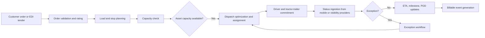
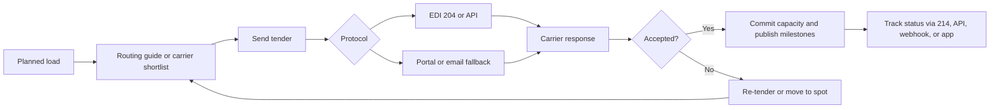
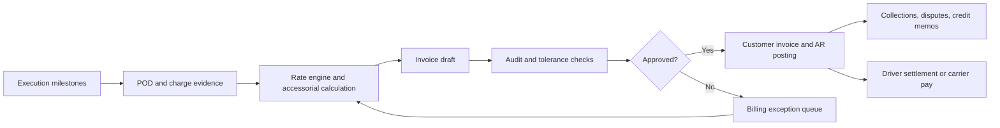
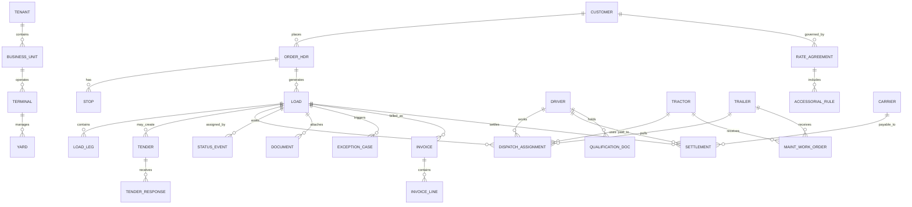

# Enterprise Transportation Management System for Trucking Operations

## Executive summary

An enterprise-grade Transportation Management System for trucking is not just dispatch software with invoicing. The benchmark products in this category combine order capture, planning, carrier and equipment orchestration, rating, tendering, execution visibility, customer and carrier portals, audit-ready financials, compliance workflows, maintenance, analytics, and a large ecosystem of integrations. Public materials from McLeod, Oracle, SAP, Blue Yonder, Manhattan, PCS, Alvys, Datatruck, and Infios show that the market expects broad end-to-end workflow coverage, partner connectivity, and increasingly cloud delivery, though the depth and architectural style differ substantially by vendor. citeturn25search0turn25search3turn32search2turn5search2turn33search0turn32search9turn29search7turn31search3turn30search2turn9search0

For the product you described, the right strategic target is an **asset-carrier-first TMS with optional brokerage and hybrid workflows**, not a telematics or ELD product. That means the system of record should own commercial intent and execution state—customers, loads, trips, tractors, trailers, terminals, invoices, settlements, claims, and workflows—while integrating outward to ELDs, visibility providers, mapping engines, load boards, accounting systems, and compliance data sources. FMCSA rules require carriers that must use ELDs to use devices listed on the registered ELD list, which strongly supports an integration strategy rather than trying to implement ELD functionality inside the TMS itself. citeturn26search3turn26search0

Architecturally, the strongest recommendation is **modular, domain-oriented services around a relational core**, with **selective event-driven processing** rather than “microservices everywhere.” Use CRUD for master data and configuration-heavy domains, and use event streams plus durable workflows for high-consequence lifecycle changes such as tenders, status transitions, settlement adjustments, POD-driven invoicing, and dispute/claims handling. CQRS and event sourcing are valuable in these narrow areas because they improve auditability and separation of write/read scaling, but even pattern advocates warn that CQRS adds complexity when overused. citeturn38search1turn38search0turn38search16turn38search17

For the operational data plane, a pragmatic enterprise stack is a **PostgreSQL-compatible OLTP database** for system-of-record entities, **object storage** for documents and images, **Redis** for caching and fast workflow coordination, **Kafka or a managed event bus** for domain events and integrations, **OpenSearch** for document and operational search, and a **warehouse** such as Snowflake or BigQuery for analytics and customer-facing BI. PostgreSQL natively supports declarative partitioning and logical replication; Aurora-compatible PostgreSQL adds managed HA and read scaling; OpenSearch is built for distributed search and analytics; BigQuery and Snowflake are designed for managed analytical workloads at scale. citeturn36search0turn16search0turn16search1turn16search10turn16search6turn16search11turn36search9turn36search13turn16search4turn36search24

From a compliance perspective, the TMS should **support** regulated workflows without pretending to be the regulated endpoint. FMCSA requires driver qualification files, HOS record retention, systematic inspection/repair/maintenance, periodic inspections, and Clearinghouse queries for CDL drivers. A TMS should therefore manage expirations, evidence capture, exception queues, reminders, and audit views while leaving certified HOS/ELD generation to registered providers. The same logic applies to IFTA, IRP, and e-title/e-credentialing initiatives: assemble data, validate it, produce audit trails, and integrate to trusted external systems where necessary. citeturn3search5turn3search9turn3search6turn3search10turn3search11turn3search19turn3search20turn3search8turn2search0turn40search0turn40search19turn2search2

The biggest product risk is not technical feasibility; it is **scope concurrency**. Dispatch, billing, settlements, maintenance, driver compliance, portals, EDI, and analytics are each substantial products. The winning roadmap is to first dominate the **quote-to-cash operating spine** for one primary segment—asset-based truckload/LTL carrier with optional brokerage—then layer specialized workflows after the data model and integration backbone are stable.

## What enterprise TMS means in this market

Public information does not fully expose the internal source-code architecture of leading TMS products, so the comparison below reflects vendor-stated deployment posture, product positioning, and ecosystem evidence rather than reverse-engineered internals.

| Vendor | Public posture on architecture and deployment | Best-fit customers | Distinguishing strengths | Cautions from market signals |
|---|---|---|---|---|
| **McLeod** | Broad, integrated enterprise TMS for carriers, brokers, 3PLs, and private fleets; emphasizes native EDI, portals, APIs, and a 140+ partner ecosystem. citeturn25search0turn25search1turn25search6turn25search13 | Large and upper-midmarket trucking carriers, brokerages, private fleets. citeturn25search3turn25search5turn25search7 | Deep operational coverage, partner network, support for LTL/private fleet, mature workflows. citeturn25search5turn25search7turn25search16 | Reviews and forum commentary consistently mention older UI, steep learning curve, and expensive or painful implementations. citeturn14search0turn34search1turn34search4turn14search7 |
| **Infios Transportation Management** formerly MercuryGate | SaaS TMS with integrated supply-chain-execution positioning; quarterly releases and mandatory minimum version policy for dedicated-server customers show an enterprise-managed release model. citeturn9search0turn9search1turn11search3 | Shippers, 3PLs, forwarders, brokers, carriers. citeturn11search5turn11search6 | Broad multimode positioning, freight audit/payment, visibility, claims, suite adjacency with OMS/WMS/YMS. citeturn9search0turn11search5 | Review snippets point to implementation issues and UI efficiency concerns. citeturn14search6turn14search10 |
| **Manhattan Active Transportation Management** | Publicly described as versionless, fully extensible, cloud-native, and based on a microservices platform with rolling updates and no-downtime upgrade posture. citeturn32search9turn32search21turn32search13 | Enterprise shippers, complex supply-chain networks, customers wanting unified WMS/TMS/YMS strategy. citeturn5search0turn32search3turn32search21 | Strong cloud posture, suite unification, modern architecture language. citeturn32search9turn32search21 | Better fit for enterprise supply-chain orchestration than pure North American trucking accounting depth. This is an inference from product positioning. citeturn5search0turn32search13 |
| **Trimble TruckMate / Trimble transportation suite** | Mature transport suite with TruckMate/TMW, EDI, maintenance, optimization, BI, and cloud services support. citeturn35search20turn28search3 | Midmarket to enterprise carriers, especially operations that value suite breadth and maintenance integration. citeturn35search20turn28search3 | Longstanding trucking depth, maintenance adjacency, broad support services. citeturn28search3turn35search20 | Market perception often groups it with legacy enterprise TMS. Public review evidence in this research set is thinner than for McLeod and MercuryGate, so this caution is lower-confidence. |
| **Oracle Transportation Management** | Cloud TMS positioned as a single platform for transportation planning, execution, freight payment, billing, and global trade management. citeturn32search2turn32search11turn32search8 | Large enterprises, global shippers, complex multimode or multinational operations. citeturn32search2turn32search11 | Deep planning, orchestration, freight payment and claims, enterprise cloud integration. citeturn5search9turn32search11turn32search19 | More supply-chain-platform-oriented than trucking-carrier-first in feel. This is an inference from product scope and target market. citeturn32search2turn32search11 |
| **SAP Transportation Management** | Transportation management integrated with SAP S/4HANA; SAP publicly documents public/private deployment options for S/4HANA and SAP TM deployment choices. citeturn5search2turn5search6turn32search7turn32search10 | SAP-centric enterprises, global shipper and logistics-service-provider scenarios. citeturn5search10turn5search19 | Strong freight planning, interactive tendering, rate determination, settlement. citeturn5search2turn5search6 | Best when the rest of the estate is already SAP-heavy. This is a common enterprise integration inference. citeturn5search6turn32search7 |
| **Blue Yonder Transportation Management** | Transportation solution increasingly described in SaaS-native and cloud terms, with planning and execution tied to the Blue Yonder network. citeturn33search0turn12search5turn33search3 | Enterprises needing planning optimization plus execution and network collaboration. citeturn12search10turn33search11 | Strong procurement/planning language, networked execution, dynamic price discovery. citeturn12search0turn12search4turn12search15 | More shipper/LSP network optimization than carrier accounting-first. This is an inference from public product language. citeturn33search0turn12search5 |
| **PCS** | Cloud-based all-in-one trucking platform combining dispatch, accounting, fleet, mobile, and analytics; carrier implementations often quoted at 30–90 days. citeturn29search7turn29search2turn29search10 | Growing trucking carriers, brokerages, and hybrid operators. citeturn29search1turn29search2turn29search9 | Practical carrier depth, trucking accounting, payroll/safety courses, broad partner set. citeturn29search13turn29search16turn28search9 | Reviews still mention dated UX and multi-screen navigation. citeturn34search16 |
| **Alvys** | Marketed as modern and cloud-native, with native EDI, public API, 120+ integrations, unlimited users, and fast onboarding. citeturn31search8turn28search0turn28search10turn31search3 | Midmarket carriers, brokers, hybrid operators, enterprises wanting quicker implementation. citeturn31search9turn31search6turn6search18 | Modern packaging, API-first posture, simpler deployment and pricing. citeturn31search1turn31search8turn28search10 | Better suited to a modern midmarket operating model than to the deepest legacy accounting/process customization. This is an inference. |
| **Datatruck** | AI-native, cloud SaaS positioning with built-in EDI, open API, and 100+ integrations; public pricing is transparent. citeturn30search2turn30search10turn30search12turn28search8 | Small-to-mid fleet carriers and growth-stage operations prioritizing speed and automation. citeturn30search2turn30search5 | Strong modern UX/automation posture, visible pricing, financial-automation narrative. citeturn30search10turn30search12 | Public evidence for very large-enterprise deployments is thinner than for McLeod, Oracle, SAP, or Manhattan. |

Two clear market patterns emerge from these vendor signals. First, **legacy enterprise TMS products win on process depth and ecosystem gravity**, especially in accounting, customization, and mixed operational edge cases; they lose on UX, implementation pain, and speed of change. Second, **newer cloud-native vendors win on usability, onboarding, public APIs, and pricing clarity**, but their deepest enterprise proof points are still developing. That pattern is visible in vendor claims and in user-review fragments from G2, Capterra, and industry forums. citeturn14search0turn14search6turn34search1turn34search4turn34search12turn34search16turn14search7turn35search8

The implication for a new entrant is important: to compete with McLeod-class systems, you do **not** need to reproduce every historical edge case on day one; you do need a data model and workflow engine capable of eventually handling them without a rewrite. The enterprise moat is the combination of breadth, auditability, integration density, and operational resilience.

## Functional domains and reference workflows

A credible enterprise trucking TMS should be designed as a set of **bounded contexts** with strong but explicit contracts between them. The right decomposition is business-first.

The core operational contexts are:

- **Commercial and customer management**: accounts, contracts, tariffs, rates, accessorials, lanes, credit status, customer contacts, instructions, SLAs, portals.
- **Order capture and load planning**: order intake, quote, routing guide, service selection, stop planning, commodity/hazmat data, appointment windows, consolidation, split/merge logic, trip building.
- **Dispatch and execution**: load boards, driver/equipment matching, tractor-trailer assignment, relay planning, trip execution, check calls, ETA management, exceptions, POD.
- **Carrier and broker operations**: procurement, carrier onboarding, insurance/compliance documents, scorecards, tendering, acceptance/rejection, brokered-load execution.
- **Assets and terminals**: tractors, trailers, devices, maintenance plans, inspections, terminals, yards, docks, parking spots, gate events, container/chassis or trailer movements when relevant.
- **Driver and workforce**: recruiting-adjacent master data, qualification files, licenses, endorsements, expirations, payroll bases, owner-operator relationships, performance history.
- **Financials**: rating, invoice generation, receivables, payables, carrier pay, driver settlements, detention, lumper, fines, escrow, fuel surcharge, tax treatment, GL export, dispute and credit memo workflows.
- **Claims and exceptions**: OS&D, shortage/damage claims, root cause, recovery, insurance, customer communication, reserve tracking.
- **Compliance and governance**: safety events, document retention, audit logs, user entitlements, workflow approvals, evidence capture.
- **Data and intelligence**: KPI models, lane profitability, cost-per-mile, dwell, on-time performance, variance analysis, anomaly detection, customer scorecards.

A useful rule is that **the TMS owns commitments and workflow state**. For example, an ELD may know the driver’s HOS clock, but the TMS owns the assignment decision, the promise to the customer, and the exception workflow when the assignment becomes impossible.

### Dispatch workflow

This is the operational heart of an asset-based carrier TMS. The flow below shows the proposed orchestration spine.



The workflow above should support both **human-assisted dispatch** and **automation-assisted dispatch**. McLeod, PCS, Blue Yonder, and SAP all publicly emphasize some combination of assignment, planning, fleet alignment, and execution control, which validates this as the operational center of gravity. citeturn25search0turn25search2turn29search2turn12search5turn12search7turn5search2turn5search6

### Tendering workflow

Tendering must support both contracted and spot execution, and both asset and brokered modes. In North American trucking, X12 transaction sets are still foundational: X12 publishes the transportation transaction-set catalog including **214 shipment status**, **990 response to a load tender**, and **997 functional acknowledgment**; AS2 remains a standard way to exchange structured business data securely over HTTP; SOAP and SFTP still exist in many enterprise environments. citeturn23search1turn23search4turn15search0turn24search0



The product lesson here is straightforward: **tender orchestration is a workflow problem before it is a protocol problem**. Build a canonical tender domain model first, then hang EDI/API/portal channels off that model.

### Billing workflow

Billing should be event-driven, evidence-driven, and tolerant of delayed or corrected documents. Oracle publicly highlights freight audit, billing, and claims; SAP highlights freight settlement; newer carrier systems emphasize invoicing and settlements as part of the same workflow spine. citeturn5search9turn5search6turn29search13turn31search12turn30search12



The core product principle is that **every financial artifact must trace back to operational evidence**: original tender or order, agreed rate, executed status history, POD, accessorial proof, settlement rules, and audit trail.

## Architecture, reliability, and deployment

The best architecture for this product is a **domain-first service architecture with strong transactional boundaries and selective event streaming**. It should look more like “coarse-grained business platforms” than dozens of hyper-fine services.

### Recommended service map

A practical enterprise decomposition is:

- **Order Service**
- **Dispatch and Trip Service**
- **Asset Service**
- **Driver Service**
- **Carrier Procurement Service**
- **Rating and Tariff Service**
- **Document Service**
- **Billing and Settlement Service**
- **Claims Service**
- **Terminal and Yard Service**
- **Compliance Service**
- **Identity and Tenant Configuration Service**
- **Integration Hub**
- **Analytics and Read Models**

This should be paired with a **workflow engine** for long-running sagas such as tender-retry sequences, detention dispute resolution, POD-chasing, multi-step settlement approvals, and customer-credit holds. A durable workflow platform such as Temporal is a strong fit because it is built around resilient workflow execution rather than ad hoc cron jobs and partial retries. citeturn16search3turn16search7turn16search20

### CRUD versus event sourcing versus CQRS

Use a tiered rule set:

**Use classic CRUD** for customer master, locations, carriers, equipment registries, users, and most configuration data.

**Use append-only domain events plus projections** for:
- shipment/load lifecycle transitions
- tender attempts and responses
- appointment changes
- settlement recalculations
- invoice adjustments and dispute state
- yard gate events
- audit-critical compliance actions

This selective approach matches the strengths of event sourcing without subjecting every screen to its complexity. Microsoft’s pattern guidance notes that event sourcing pairs well with CQRS and can independently scale append-heavy writes and read-optimized projections; Martin Fowler also explicitly warns that CQRS adds risk and complexity when applied too broadly. citeturn38search1turn38search0turn38search16turn38search2

### Integration backbone

For the integration plane, the cleanest split is:

- **Kafka or equivalent streaming platform** for high-volume immutable domain events, partner event feeds, and analytical taps. Kafka describes itself as a distributed event-streaming platform for high-performance data pipelines and mission-critical applications. citeturn15search7turn15search15
- **RabbitMQ or equivalent queue broker** for command queues, retries, request/response wrappers, and system integration tasks where strict workflow control matters more than streaming scale. RabbitMQ explicitly frames itself as a mature messaging broker built around queues and routing. citeturn21search0turn21search3turn21search21
- **Managed event bus** such as EventBridge when you want lighter-weight cloud-native event routing and SaaS/service integration. AWS documents EventBridge as a service for scalable event-driven applications made of loosely coupled components. citeturn15search2turn15search18

### Nonfunctional requirements

An enterprise TMS in this category should be designed to meet targets such as:

- **Availability**: 99.9% as a floor, with 99.95% for premium tiers.
- **RPO/RTO**: near-zero RPO for core OLTP via synchronous multi-AZ replication; under 30 minutes RTO for region failure with prebuilt DR playbooks.
- **Performance**: P95 under 300 ms for common reads, under 1 second for operational board queries, under 5 seconds for heavy filtered operational reports, and deterministic backpressure on batch imports.
- **Isolation**: tenant, legal-entity, and role isolation, with customer-configurable data-retention policies.
- **Auditability**: immutable event history for material state changes and complete user-action logging.
- **Scalability**: independent read scaling for operational boards and analytics, independent async processing for imports and partner messages.

For the database tier, Aurora documents multi-AZ replication and failover across six storage nodes, and Aurora-compatible PostgreSQL supports up to 15 replicas for read scaling. PostgreSQL itself supports logical replication and declarative partitioning—both relevant for operational sharding, geography-based replay, and reporting offload. citeturn16search1turn16search18turn16search10turn16search0turn36search0

### Deployment options

Kubernetes remains the default control plane for serious multi-service deployment; the project defines itself as production-grade container orchestration for scaling and managing containerized applications. citeturn18search2turn18search18

For deployment models:

- **Public cloud SaaS** should be the default.
- **Hybrid** matters for customers with data residency, latency, or legacy systems on-prem. AWS Outposts, Azure Arc, and Google Distributed Cloud each position themselves as hybrid/on-prem extensions of their respective control planes. citeturn18search0turn18search11turn18search12turn18search1
- **Dedicated single-tenant SaaS** should be offered for very large or regulated customers.
- **Full on-prem** can be supported only if it is commercially justified; otherwise it becomes a drag on release velocity.

### CI/CD, observability, and testing

Use Git-based CI/CD, automated security scanning, contract tests, and progressive delivery. GitHub Actions provides native CI/CD automation; Argo Rollouts provides blue-green and canary rollout strategies for Kubernetes. citeturn20search1turn20search3turn20search6

For observability, the industry baseline is now OpenTelemetry plus Prometheus-compatible metrics, with readiness and liveness probes enforced at the platform. OpenTelemetry provides vendor-neutral APIs, libraries, and collectors for traces, metrics, and logs; Prometheus is an open-source monitoring and alerting toolkit; Kubernetes probes distinguish “alive” from “ready to take traffic.” citeturn19search0turn19search4turn19search1turn19search5turn19search6

Testing should be layered:

- unit and domain-rule tests
- API contract tests
- scenario/integration tests against real brokers and partner simulators
- property-based tests for rate and settlement calculations
- replay tests using production-like historical events
- resilience tests for message duplication, out-of-order events, retry storms, and regional failover
- UAT sandboxes with masked production-shaped data

## Data model and persistence

### Design principles

The dominant mistake in TMS products is to model **loads** as the only first-class object. Enterprise systems need at least four distinct operational concepts:

- **Order**: the commercial request or customer commitment.
- **Load/Shipment Execution**: the executable movement unit.
- **Trip/Movement Plan**: how assets and drivers will physically perform the work.
- **Financial artifacts**: invoices, settlements, payables, disputes.

Those are related, but they are not the same object.

### Core entity model

A recommended enterprise schema should include the following major aggregates:

- **Tenant**, **LegalEntity**, **BusinessUnit**, **Terminal**, **Yard**, **Dock**
- **Customer**, **Consignee**, **Shipper**, **Carrier**, **Broker**, **OwnerOperator**
- **Order**, **OrderLine**, **Commodity**, **HazmatProfile**, **Stop**, **Appointment**
- **Load**, **Leg**, **Trip**, **DispatchAssignment**
- **Tractor**, **Trailer**, **EquipmentClass**, **Device**
- **Driver**, **QualificationDocument**, **License**, **Endorsement**, **MedicalCard**
- **RateAgreement**, **Tariff**, **AccessorialRule**, **FuelSurchargeProgram**
- **Tender**, **TenderAttempt**, **TenderResponse**
- **StatusEvent**, **GeoEvent**, **PODDocument**, **ExceptionCase**
- **Invoice**, **InvoiceLine**, **Settlement**, **Payable**, **Claim**
- **MaintenanceWorkOrder**, **InspectionRecord**, **Defect**
- **EdiMessage**, **ApiIntegration**, **WebhookSubscription**
- **AuditEvent**, **ApprovalTask**, **WorkflowInstance**

The ER diagram below shows the minimum viable relational backbone for an enterprise product.



### Sample schema fragments

A normalized relational core can still expose friendly domain APIs. The following sample tables illustrate the shape.

```sql
create table order_hdr (
  order_id uuid primary key,
  tenant_id uuid not null,
  customer_id uuid not null,
  service_mode text not null,
  source_system text not null,
  external_ref text,
  status text not null,
  ordered_at timestamptz not null,
  contract_id uuid,
  total_weight_lb numeric(12,2),
  total_pieces integer,
  bill_to_party_id uuid,
  created_by uuid not null,
  created_at timestamptz not null default now()
);

create table load (
  load_id uuid primary key,
  tenant_id uuid not null,
  order_id uuid not null,
  execution_mode text not null, -- asset, brokered, interline
  load_status text not null,
  planned_miles numeric(10,2),
  equipment_type text,
  primary_driver_id uuid,
  primary_tractor_id uuid,
  primary_trailer_id uuid,
  dispatch_board_date date,
  revenue_amount numeric(14,2),
  cost_estimate_amount numeric(14,2),
  version integer not null default 1
);

create table dispatch_assignment (
  assignment_id uuid primary key,
  tenant_id uuid not null,
  load_id uuid not null,
  driver_id uuid not null,
  tractor_id uuid,
  trailer_id uuid,
  committed_at timestamptz not null,
  committed_by uuid not null,
  dispatch_status text not null,
  sequence_no integer not null
);

create table invoice (
  invoice_id uuid primary key,
  tenant_id uuid not null,
  load_id uuid not null,
  customer_id uuid not null,
  invoice_status text not null,
  currency_code text not null default 'USD',
  invoice_total numeric(14,2) not null,
  pod_received_at timestamptz,
  posted_to_erp_at timestamptz,
  created_at timestamptz not null default now()
);

create table edi_message (
  edi_message_id uuid primary key,
  tenant_id uuid not null,
  partner_id uuid not null,
  transaction_set text not null, -- 204, 990, 214, 210, 997
  direction text not null,       -- inbound, outbound
  transport_protocol text not null, -- as2, sftp, van
  interchange_control_no text,
  status text not null,
  raw_payload_uri text not null,
  canonical_document jsonb,
  received_at timestamptz not null,
  processed_at timestamptz
);
```

### Recommended data technologies

The recommended persistence stack is shown below.

| Need | Recommended technology | Why it fits |
|---|---|---|
| System of record for orders, loads, dispatch, invoices, master data | **PostgreSQL-compatible OLTP** such as Aurora PostgreSQL or Azure Database for PostgreSQL | Strong relational integrity, mature indexing, partitioning, replication, JSON support for integration sidecars, good fit for transactional freight workflows. PostgreSQL supports declarative partitioning and logical replication; Aurora adds managed HA and replicas. citeturn36search0turn16search0turn16search1turn16search10 |
| Hot cache, idempotency keys, workflow coordination | **Redis** | Redis positions itself around caching, queuing, and event processing, and sub-millisecond caching is useful for dispatch boards, entitlement checks, and route/tariff memoization. citeturn36search1turn36search6 |
| Full-text and operational search | **OpenSearch** | Search box, document search, load search, and exception triage benefit from a distributed search engine. citeturn16search6turn16search11 |
| Documents, images, EDI raw payloads, scanned POD/BOL | **S3-compatible object storage** | Object stores are purpose-built for unstructured documents and high durability; S3 documents 11 nines durability and multi-AZ storage by default. citeturn37search9turn37search15 |
| Analytics warehouse | **Snowflake** or **BigQuery** | Both support structured and semi-structured analytics at scale; BigQuery is fully managed and serverless; Snowflake supports structured and semi-structured data with multi-cloud posture. citeturn36search9turn36search13turn16search4turn36search24 |
| Event log / streaming | **Kafka** | High-volume event fan-out, replay, partner integration, audit taps, BI, ML features. citeturn15search7turn15search15 |
| Command queues / retries | **RabbitMQ** | Better when you need routing and durable task queues around imperative workflows. citeturn21search0turn21search3 |

For multi-tenancy, the strongest model is **cell-based SaaS**:

- pooled app tier with tenant-aware isolation,
- pooled database for smaller tenants using `tenant_id` plus strong authorization and audit controls,
- optional dedicated database or dedicated cell for larger enterprise tenants,
- shared integration and observability control plane.

This is usually a better economic and operational compromise than “everything shared” or “everything single-tenant.”

## Integration strategy and external ecosystem

### Protocol and API patterns

A serious TMS has to coexist with three integration eras at once:

- **EDI/B2B era**: ANSI X12, AS2, VANs, SFTP batch drops.
- **Enterprise service era**: SOAP, file drops, scheduled ETL, ERP connectors.
- **Modern platform era**: REST/JSON, webhook callbacks, streaming events.

You need all three.

X12’s transportation catalog formally defines key transaction sets used in trucking and logistics, including **214 Transportation Carrier Shipment Status Message**, **990 Response to a Load Tender**, and **997 Functional Acknowledgment**. AS2 is formally defined in RFC 4130 as secure peer-to-peer business data interchange over HTTP and explicitly supports structured business data such as X12 and EDIFACT. SOAP 1.2 remains the W3C standard for structured XML messaging in distributed systems. OpenAPI remains the dominant standard way to describe HTTP APIs. citeturn23search1turn23search4turn15search0turn24search0turn15search17

### Recommended integration architecture

The cleanest architecture is a **canonical integration model** inside the platform:

- partner-specific adapters at the edge,
- canonical shipment/tender/rate/invoice events in the middle,
- workflow and validation engine behind the canonical layer.

That architecture prevents protocol sprawl from contaminating core business services.

The recommended integration hub should provide:

- partner profiles and credentials
- mapping and transformation
- schema versioning
- AS2/SFTP/REST endpoints
- acknowledgment tracking
- replay and dead-letter handling
- idempotency and deduplication
- operational dashboards by trading partner
- payload archiving and redaction

### Common third-party integrations

The enterprise ecosystem normally includes:

- **ERPs/AP**: Oracle ERP, NetSuite, SAP, Dynamics, QuickBooks for smaller fleets
- **WMS/OMS**: shipper-side warehouse and order systems
- **Load boards and capacity**: DAT, Truckstop, 123Loadboard
- **Visibility providers**: project44, FourKites, MacroPoint and comparable services
- **Mapping/routing**: Trimble Maps/PC*MILER, HERE, Google Maps, Mapbox
- **Rate and optimization engines**: LTL rate engines, routing and procurement optimizers
- **Payments/factoring**: ACH, card, fuel card, factoring platforms, digital-pay vendors
- **Compliance and carrier qualification**: RMIS and peers, FMCSA data sources
- **Document services**: OCR, e-signature, document capture and classification
- **Cloud identity**: Entra ID/Azure AD, Okta, Auth0/CIC, Ping

Examples from public documentation confirm that modern TMS ecosystems commonly include API access to DAT and Truckstop load boards, project44 truckload tracking APIs, and vast integration marketplaces from TMS vendors themselves. citeturn27search0turn27search1turn27search2turn27search6turn28search0turn28search8turn25search13

For mapping and routing, the provider choice should depend on whether the workload is **truck legal/commercial vehicle routing** or **consumer-style ETAs**. Trimble Maps explicitly supports truck routing based on vehicle dimensions, hazmat, and restrictions; HERE documents truck restrictions and truck-route calculations; Google and Mapbox are strong for generalized route/ETA and optimization workloads but are less trucking-specific in published posture. citeturn22search0turn22search12turn22search20turn22search17turn22search9turn22search10turn22search11turn22search7

### Example API contract snippets

The contracts below are illustrative design recommendations, not excerpts from an existing vendor API.

```yaml
openapi: 3.1.0
info:
  title: TMS Order Service
  version: 1.0.0
paths:
  /orders:
    post:
      summary: Create a transportation order
      operationId: createOrder
      requestBody:
        required: true
        content:
          application/json:
            schema:
              type: object
              required: [customerId, mode, stops]
              properties:
                customerId:
                  type: string
                  format: uuid
                mode:
                  type: string
                  enum: [TL, LTL, Dedicated, Brokerage]
                externalRef:
                  type: string
                commodities:
                  type: array
                  items:
                    $ref: '#/components/schemas/Commodity'
                stops:
                  type: array
                  minItems: 2
                  items:
                    $ref: '#/components/schemas/Stop'
      responses:
        '201':
          description: Order created
  /loads/{loadId}/tenders:
    post:
      summary: Tender a load to an internal asset plan or external carrier
      operationId: tenderLoad
      parameters:
        - in: path
          name: loadId
          required: true
          schema: { type: string, format: uuid }
      requestBody:
        required: true
        content:
          application/json:
            schema:
              type: object
              required: [channel, partnerId]
              properties:
                channel:
                  type: string
                  enum: [ASSET, EDI_204, API, PORTAL, EMAIL]
                partnerId:
                  type: string
                  format: uuid
                expiresAt:
                  type: string
                  format: date-time
      responses:
        '202':
          description: Tender accepted for processing
  /loads/{loadId}/billing:
    post:
      summary: Generate a billable invoice draft from execution evidence
      operationId: createInvoiceDraft
      parameters:
        - in: path
          name: loadId
          required: true
          schema: { type: string, format: uuid }
      responses:
        '201':
          description: Invoice draft created

components:
  schemas:
    Stop:
      type: object
      required: [sequence, type, location, appointmentWindow]
      properties:
        sequence: { type: integer }
        type: { type: string, enum: [PICKUP, DELIVERY, RELAY, TERMINAL] }
        location:
          type: object
          required: [name, city, state]
          properties:
            name: { type: string }
            city: { type: string }
            state: { type: string }
            postalCode: { type: string }
            country: { type: string, default: US }
        appointmentWindow:
          type: object
          properties:
            start: { type: string, format: date-time }
            end: { type: string, format: date-time }
    Commodity:
      type: object
      properties:
        description: { type: string }
        weightLb: { type: number }
        pieces: { type: integer }
        nmfcClass: { type: string }
        hazmat: { type: boolean }
```

A webhook contract is equally important for customer portals, partner APIs, and internal automation.

```yaml
webhooks:
  load.statusChanged:
    post:
      requestBody:
        required: true
        content:
          application/json:
            schema:
              type: object
              required: [eventId, eventType, occurredAt, loadId, status]
              properties:
                eventId: { type: string, format: uuid }
                eventType: { type: string, example: load.statusChanged }
                occurredAt: { type: string, format: date-time }
                tenantId: { type: string, format: uuid }
                loadId: { type: string, format: uuid }
                status:
                  type: string
                  enum: [DISPATCHED, ARRIVED_PICKUP, LOADED, IN_TRANSIT, ARRIVED_DELIVERY, DELIVERED, POD_RECEIVED]
```

OpenAPI is the right public contract surface for these APIs because it is the widely adopted standard for describing HTTP APIs in a way machines and people can consume. citeturn15search17

## Compliance, security, operating model, roadmap, economics, and risks

### Compliance and regulatory support without building ELDs

Your TMS does **not** need to be the statutory source of truth for everything. It does need to be the **workflow and evidence coordinator**.

FMCSA rules require each motor carrier to maintain a **driver qualification file** for each employed driver, and the file must generally be retained during employment and for three years after. FMCSA HOS rules require records of duty status and supporting documents to be retained, and the rules also define supporting-document handling. FMCSA Part 396 requires systematic inspection, repair, and maintenance, plus periodic inspections. The FMCSA Clearinghouse requires annual queries for employed CDL drivers. In addition, FMCSA’s Safety Measurement System uses inspection, crash, and investigation data to assess safety risk, which makes carrier and driver compliance data operationally relevant to a TMS. citeturn3search5turn3search9turn3search6turn3search10turn3search14turn3search11turn3search19turn3search20turn3search8turn4search1turn4search4

What that means in product terms:

- **Driver management** should include licenses, endorsements, medical certificates, prior-employer investigations, annual MVR tasks, Clearinghouse evidence, and DQF document storage.
- **HOS-aware dispatch** should ingest availability and exception flags from the certified ELD provider, but should not try to generate compliant ELD output itself.
- **Maintenance workflows** should support PM schedules, defects, repairs, annual inspections, and inspection evidence search.
- **Carrier qualification workflows** should include insurance, operating authority status, safety data, document expirations, and scorecards.

For tax and registration support, the TMS should keep detailed trip, fuel, plate, and jurisdiction data. IFTA is administered through member jurisdictions with official guidance and tax-rate materials published by IFTA, Inc. The International Registration Plan is a reciprocity agreement spanning the 48 contiguous U.S. states, D.C., and ten Canadian provinces; apportioned registration depends on jurisdictional activity and vehicle characteristics. e-title/e-credentialing efforts such as AAMVA’s eCMV work suggest that digital title and registration exchange will continue to expand, but state execution remains fragmented. citeturn2search0turn2search1turn40search0turn40search19turn2search2

For privacy, the platform should assume a fragmented U.S. state-law environment. California’s CCPA gives consumers rights to know, delete, opt out, and avoid discrimination for exercising those rights. Colorado’s Privacy Act has been in force since July 1, 2023, and Virginia’s CDPA gives consumers request-and-response rights with statutory timing obligations. That matters if customer portals, carrier portals, or employee/driver data cross legal thresholds. citeturn39search0turn39search1turn39search2turn39search3

### Security controls

Security design should be enterprise-grade from the first release, because the moment you store invoices, payroll bases, settlement details, insurance certificates, and driver PII, you are in a serious control environment.

The recommended baseline is:

- **Centralized IAM** with SSO, MFA, SCIM provisioning, and federation.
- **RBAC with optional ABAC overlays** for role + terminal + business-unit + tenant scoping. NIST’s RBAC model is an ANSI standard and remains the right baseline vocabulary for enterprise authorization design. citeturn17search15turn17search20
- **Risk-based authentication and identity proofing** aligned to current NIST digital identity guidance. citeturn17search11turn17search16
- **Encryption everywhere**: TLS in transit, per-tenant logical separation, KMS/HSM-backed key material, envelope encryption for documents and secrets. NIST SP 800-57 remains the core reference for cryptographic key-management best practices. citeturn17search1turn17search8
- **Immutably queryable audit logs** for entitlements, approvals, record changes, and integration events. OWASP’s logging guidance is directly relevant here. citeturn17search2turn17search5
- **SOC 2-oriented controls** for security, availability, processing integrity, confidentiality, and privacy. The AICPA trust-services criteria remain the standard external language customers will use during procurement. citeturn17search10turn17search14

### Operating model and customer success

Enterprise success in this category depends as much on rollout mechanics as on software.

The product needs:

- **implementation playbooks by segment**: truckload carrier, LTL carrier, private fleet, hybrid carrier/broker
- **data migration tooling** for customers coming from spreadsheets, legacy desktop systems, or older TMS exports
- **configuration frameworks** for tenant-specific rules without code forks
- **sandbox and UAT tenants**
- **customer onboarding content**, certification tracks, and role-based training
- **support tiers** with low-latency operational support for dispatch/billing outages
- **release management communications** and safe rollout controls

Vendors that publicize fast implementations and onboarding simplicity use that as a strategic wedge. PCS markets 30–90 day carrier implementations; Alvys and Datatruck emphasize fast onboarding and cloud simplicity; MercuryGate’s mandatory release cadence underscores the importance of operational release discipline in enterprise TMS. citeturn29search2turn31search1turn31search9turn30search2turn9search1

### Phased roadmap

A sensible enterprise roadmap is:

| Phase | What to ship | Why it belongs here |
|---|---|---|
| **Foundation** | Identity, tenant config, locations, customers, equipment, drivers, terminals, documents, audit, canonical API/event model | Everything else becomes fragile without a stable reference-data and security backbone. |
| **Quote-to-cash spine** | Order entry, dispatch board, trip building, status milestones, POD capture, rating, invoice generation, driver/owner-op settlements, AR/AP export | This is the minimum operating system for a real carrier business. |
| **Partner connectivity** | EDI 204/990/214/210/997, APIs, webhooks, load-board posting and search, customer portal, brokered-carrier tendering | Enterprise buyers will reject a modern UI that still requires manual swivel-chair integration. |
| **Compliance and asset orchestration** | DQF workflows, expirations, maintenance, PM, inspections, terminal/yard visibility, carrier qualification | This is the point where the TMS becomes sticky for larger fleets. |
| **Advanced optimization and intelligence** | Routing, dock/yard optimization, dynamic pricing, recommended assignments, profitability analytics, exception prediction | These features matter most after data quality and workflow adoption are stable. |
| **Enterprise hardening** | Dedicated deployments, disaster recovery options, advanced approvals, audit exports, regional data controls, premium SLA | This closes the gap with McLeod/Oracle/SAP-class procurement expectations. |

### Cost and resourcing estimates

These are planning estimates, not sourced price quotes.

#### Build profile

For a serious enterprise-capable product over roughly 24–36 months, a reasonable sustained team is:

- 1 product leader
- 3–5 product managers / solution analysts
- 1–2 architects
- 14–24 application engineers
- 4–7 frontend/mobile engineers
- 4–6 QA / test automation engineers
- 3–5 integration / EDI engineers
- 2–4 SRE / platform engineers
- 1–2 data engineers / analytics engineers
- 1 security engineer
- 1 implementation lead plus solutions consultants as customers arrive
- support and documentation staff as soon as production customers go live

That is roughly **32–57 people** at maturity.

#### Rough annualized cost bands

| Scenario | Team and capability profile | Annual cost range |
|---|---|---|
| **Focused enterprise seed-stage build** | Strong quote-to-cash spine, API-first, limited EDI, one primary segment | **$6M–$10M** |
| **Serious enterprise scale-up** | Full asset-carrier core, EDI team, portals, maintenance/compliance, real support org | **$12M–$22M** |
| **Leader-challenger build** | Broad enterprise coverage across carrier/broker/hybrid, premium SLAs, larger implementation and customer-success motion | **$25M–$45M+** |

#### Infrastructure expectations

Infra cost varies wildly with tenant count, document volume, event volume, and analytics posture, but broad yearly ranges are:

- **early product / low tenant count**: **$150k–$500k**
- **growing SaaS with real integrations and observability**: **$500k–$2M**
- **multi-region enterprise SaaS with dedicated cells and analytics**: **$2M–$8M+**

The cost drivers are not just compute. They are also object storage for documents, partner message traffic, search clusters, BI workloads, DR duplication, and observability volume.

### Vendor and technology recommendations

A strong default stack, assuming no language constraint, would be:

| Layer | Recommended options |
|---|---|
| Frontend | React + TypeScript for web; React Native or Flutter for driver/mobile support |
| APIs | gRPC internally where needed, REST/JSON externally, OpenAPI-described |
| Core backend | Java/Kotlin, C#, or Go; choose one and standardize |
| OLTP | Aurora PostgreSQL or managed PostgreSQL equivalent |
| Cache | Redis |
| Search | OpenSearch |
| Object store | S3 / Azure Blob / GCS equivalent |
| Streaming | Kafka or managed equivalent |
| Workflow engine | Temporal |
| Queueing | RabbitMQ where imperative routing/retry semantics are needed |
| Analytics | Snowflake or BigQuery |
| Identity | Entra ID, Okta, Auth0/CIC, or Ping depending enterprise preference |
| API gateway | Kong, Apigee, Azure API Management, or cloud-native equivalent |
| Observability | OpenTelemetry collector + Prometheus-compatible metrics + centralized logs + trace backend |
| Kubernetes | EKS / AKS / GKE, with GitOps and progressive delivery |
| Mapping | Trimble Maps first for truck-legal routing; HERE as strong alternative; Google/Mapbox for non-truck-specialized workloads |

### Risks and mitigations

The major risks are predictable.

**Scope explosion** is the first. The mitigation is to build the quote-to-cash backbone first and keep adjacent domains on the same canonical model.

**Integration entropy** is the second. The mitigation is a canonical integration layer, strict partner adapters, versioning, and replayable message archives.

**Financial correctness risk** is the third. Rating, settlements, payroll, and claims produce trust failures when wrong. The mitigation is property-based testing, immutable calculation traces, and side-by-side validation during cutovers.

**Multi-tenant data leakage** is the fourth. The mitigation is defense-in-depth: tenant-scoped authz, row-level isolation, immutable audit, red-team exercises, and high-coverage integration tests.

**Operational brittleness from over-microservicing** is the fifth. The mitigation is coarse-grained bounded contexts, not service-per-table design.

**Low-quality migration data** is the sixth. The mitigation is migration staging, reconciliation ledgers, and dual-run reporting until customer sign-off.

### Open questions and limitations

A few topics remain naturally organization-specific:

- whether your first deep segment is truckload carrier, LTL, private fleet, or hybrid carrier/broker
- how much embedded accounting you want versus ERP export depth
- whether you want premium single-tenant or hybrid deployments from the start
- how deep your first-party optimization should go versus using external routing/rate engines initially
- whether payroll is core or “settlements-first” in phase one

Those choices affect architectural boundaries, sequencing, and budget more than any individual framework selection.

The highest-confidence conclusion is this: **to compete with McLeod-, MercuryGate-, Manhattan-, Trimble-, PCS-, Alvys-, and Datatruck-class systems, you need an audit-safe relational core, selective event-driven orchestration, serious integration infrastructure, and a roadmap disciplined enough to build depth without drowning in breadth.** Public vendor evidence strongly suggests that the market now rewards one of two extremes—either deep legacy breadth or modern connected usability. The best new entrant strategy is to combine the **operational depth of the first** with the **deployment speed and API-first ergonomics of the second**.