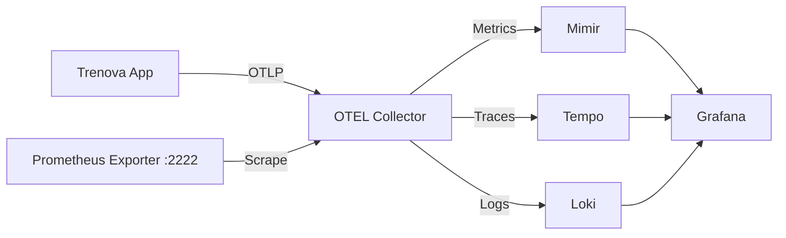

<!--
Copyright 2023-2025 Eric Moss
Licensed under FSL-1.1-ALv2 (Functional Source License 1.1, Apache 2.0 Future)
Full license: https://github.com/emoss08/Trenova/blob/master/LICENSE.md-->
# Trenova Observability Guide

## Overview

Trenova uses the LGTM stack (Loki, Grafana, Tempo, Mimir) for comprehensive observability:

- **Mimir**: Long-term metrics storage (Prometheus-compatible)
- **Loki**: Log aggregation and querying
- **Tempo**: Distributed tracing
- **Grafana**: Visualization and dashboards
- **OpenTelemetry Collector**: Central telemetry collection hub

## Architecture



## Accessing the Dashboard

1. **Start the LGTM stack**:

   ```bash
   docker-compose -f docker-compose-local.yml up -d
   ```

2. **Access Grafana**:
   - URL: <http://localhost:3000>
   - Default credentials: admin/admin

3. **View the Enterprise Dashboard**:
   - Navigate to Dashboards → Trenova → Enterprise Metrics Dashboard
   - Or direct link: <http://localhost:3000/d/trenova-comprehensive>

## Dashboard Sections

### System Overview

- Service status indicator
- Request rate (requests/second)
- Error rate percentage
- P95 latency
- Cache hit rate
- Active database connections
- Goroutine count
- Memory usage

### HTTP Metrics

- Request rate by status code
- Response time percentiles (P50, P90, P95, P99)
- Requests by endpoint (pie chart)
- Error rate by endpoint (table)

### Database Metrics

- Database operations rate by type
- Query duration percentiles
- Connection pool utilization
- Database errors by operation

### Cache Metrics

- Cache hit rate over time
- Cache operations by type
- Hits vs misses comparison
- Cache operation latency

### System Resources

- Memory usage (heap, system)
- Goroutine count
- CPU usage percentage
- GC pause time

### Queue Metrics

- Job processing rate by type
- Job duration percentiles

## Alerts

The system includes comprehensive alerting rules:

### Critical Alerts

- Service down (> 5 minutes)
- Very high latency (P95 > 5s)
- Very high memory usage (> 2GB)

### Warning Alerts

- High error rate (> 5%)
- High latency (P95 > 1s)
- Database connection pool exhaustion (> 90%)
- Low cache hit rate (< 80%)
- High CPU usage (> 80%)

## Metrics Endpoints

- **Application Metrics**: <http://localhost:2222/metrics>
- **OTEL Collector Metrics**: <http://localhost:8888/metrics>
- **Mimir API**: <http://localhost:9009>
- **Tempo API**: <http://localhost:3200>
- **Loki API**: <http://localhost:3100>

## Configuration Files

- **OTEL Collector**: `config/otel-collector-config.yaml`
- **Mimir**: `config/mimir-config.yaml`
- **Grafana Datasources**: `config/grafana/provisioning/datasources/datasources.yaml`
- **Alert Rules**: `config/mimir/rules/trenova-alerts.yml`
- **Dashboard**: `config/grafana/provisioning/dashboards/trenova-comprehensive-dashboard.json`

## Troubleshooting

### No metrics showing up

1. Check if the application is exposing metrics:

   ```bash
   curl http://localhost:2222/metrics
   ```

2. Verify OTEL collector is running:

   ```bash
   docker logs otel-collector
   ```

3. Check Mimir ingestion:

   ```bash
   curl http://localhost:9009/api/v1/query?query=up
   ```

### Dashboard not loading

1. Check Grafana logs:

   ```bash
   docker logs grafana
   ```

2. Verify datasources are configured:
   - Go to Configuration → Data Sources in Grafana
   - Should see Prometheus, Tempo, and Loki

### High memory usage

- Adjust retention periods in Mimir configuration
- Reduce scrape intervals in OTEL collector
- Enable sampling in application telemetry

## Best Practices

1. **Metric Naming**: Follow Prometheus conventions (e.g., `trenova_http_requests_total`)
2. **Label Cardinality**: Avoid high-cardinality labels (user IDs, session IDs)
3. **Dashboard Organization**: Group related metrics in rows
4. **Alert Tuning**: Adjust thresholds based on your SLOs
5. **Resource Limits**: Set appropriate memory limits for observability stack

## Extending Observability

### Adding Custom Metrics

```go
// In your code
counter := metrics.Meter.Int64Counter(
    telemetry.MetricName("custom", "operations_total"),
    metric.WithDescription("Custom operations"),
)
counter.Add(ctx, 1, metric.WithAttributes(
    attribute.String("type", "custom"),
))
```

### Adding Custom Dashboards

1. Create dashboard in Grafana UI
2. Export as JSON
3. Save to `config/grafana/provisioning/dashboards/`
4. Restart Grafana

### Adding Alert Rules

1. Edit `config/mimir/rules/trenova-alerts.yml`
2. Add new rule following Prometheus format
3. Restart Mimir to reload rules
